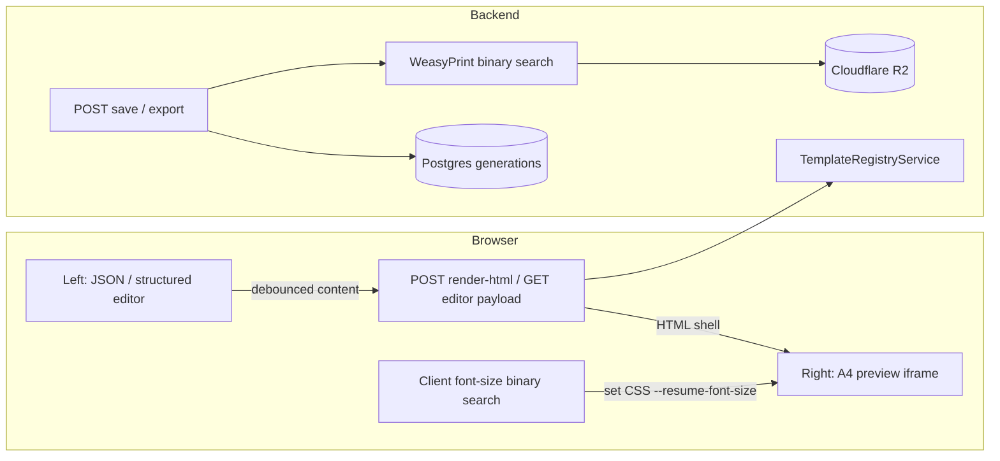
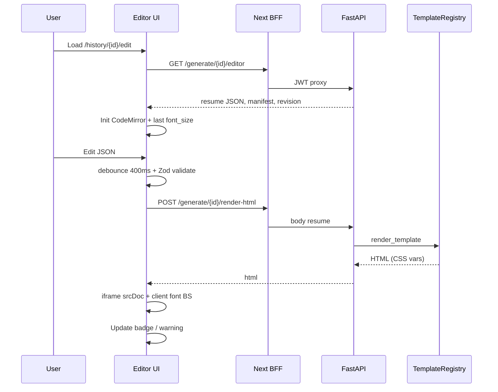
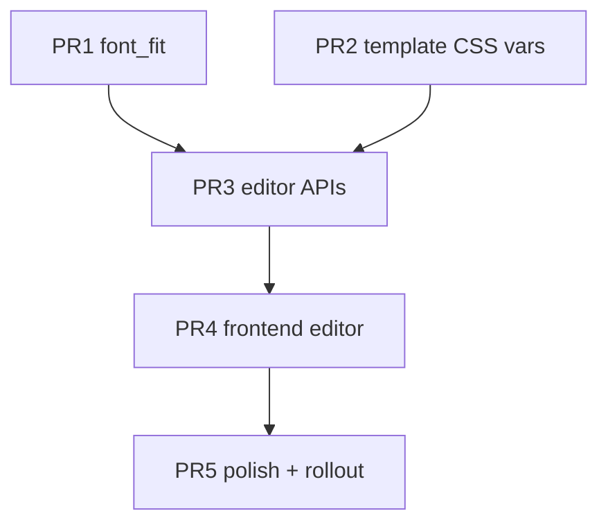

# Design: Live Split-Pane Resume Editor (Overleaf-style)

| Field | Value |
|-------|-------|
| **Author** | TBD |
| **Date** | 2026-07-09 |
| **Status** | Draft |
| **Related** | Generation pipeline (`render_node`), History UI, Admin template sandbox |

---

## Overview

Completed generations today are download-only: users cannot revise the tailored resume JSON and re-fit it to one page. This design adds an **Overleaf-style split editor**—JSON (or structured) editing on the left, live resume preview on the right—with the same **min/max font-size fit rule** the generation pipeline uses. If content still overflows at the template minimum font size, the editor **allows multi-page output** and shows a clear warning (unlike the generation pipeline, which auto-strips bullets via `content_reduction_node`).

**Recommended architecture: hybrid.** Live editing uses a **debounced server Jinja HTML render** for content fidelity plus **client-side CSS font-size binary search** over a fixed A4 viewport for snappy fit feedback. **Final PDF export and persistence always re-run WeasyPrint** on the backend so downloadable artifacts match production pagination. Pure in-browser WeasyPrint is not realistic; pure client-only HTML will diverge from PDF layout.

---

## Background & Motivation

### Current state

| Layer | Behavior |
|-------|----------|
| **Generation model** (`backend/src/models/generation.py`) | Stores `pdf_storage_key`, `md_storage_key`, `thumb_storage_key`, `render_metadata` (JSONB), `content_split`, `template_id`, status. Final JSON is `render_metadata.tailored_resume`; font size is `render_metadata.font_size`. |
| **Render fit** (`backend/src/pipeline/nodes.py` → `render_node`) | Binary-searches font size with WeasyPrint page counts between `min_font_size` and `max_font_size` from the template manifest. |
| **Overflow during generation** | `graph.route_after_render` → `content_reduction_node` strips bullets (up to 2 steps), then re-assembles and re-renders. |
| **Preview/download APIs** (`backend/src/api/generation.py`) | Re-render from stored `tailored_resume` + **fixed** `font_size` from metadata. **No** re-run of binary search. |
| **Frontend History** (`frontend/app/dashboard/history/HistoryClient.tsx`) | List/grid of generations; click → download. No edit path. |
| **Admin sandbox** (`AdminClient.tsx` templates tab + `POST /admin/templates/sandbox/render`) | JSON textarea + iframe `srcDoc` HTML preview—closest existing UX primitive. |

### Pain points

1. Users cannot fix AI typos, tweak bullets, or rebalance content after generation without starting a new (credit-consuming) run.
2. Preview APIs freeze the generation-time font size; editing content without re-fitting produces wrong density or multi-page PDFs without warning.
3. Product intent for the **editor** differs from the **generator**: generator may strip content to force 1-page; editor must **preserve user content**, warn, and allow overflow.

### Template constraints (personal-classic)

From `backend/templates/personal-classic/manifest.json`:

- `target_pages`: 1  
- `min_font_size`: 9.0  
- `max_font_size`: 11.5  
- `page_margin_mm`: 10  

Template injects size via Jinja (`template.jinja2`):

```jinja2
body { font-size: {{ font_size }}pt; }
h1 { font-size: calc({{ font_size }}pt * 2.4); }
/* ... */
@page {
  margin: {{ page_margin_mm }}mm;
  margin-bottom: {{ page_margin_mm * 0.7 }}mm;
}
```

Fonts: Computer Modern TTF under `templates/personal-classic/fonts/`. Icons: SVG under `icons/`. Layout uses print CSS (`@page`), which browsers only partially honor for on-screen layout.

---

## Goals & Non-Goals

### Goals

1. Split-pane editor for **completed** authenticated generations: left data editor, right live preview.
2. Re-evaluate text size on content change using the same min/max/target_pages as the template manifest.
3. If content cannot fit even at `min_font_size`: keep content, use min size, allow multi-page, show warning.
4. Debounced live feedback without spamming full PDF generation.
5. Persist edits, re-export PDF/MD/thumbnail to R2, update `render_metadata`.
6. Audit and harden the pipeline binary search (shared library for generation + editor export).
7. Ship via incremental, independently reviewable PRs.

### Non-Goals

1. Re-running the LangGraph AI pipeline from the editor (no re-tailoring).
2. Collaborative multiplayer editing / CRDT.
3. Full offline-only editing with zero network (Jinja templates stay server-side in v1).
4. Perfect pixel match between browser preview and WeasyPrint PDF (document and mitigate; do not block on it).
5. Guest-generation editor in v1 (guests expire; scope to logged-in users first).
6. Auto content reduction (bullet stripping) in the editor—user decides what to cut.
7. WASM WeasyPrint or headless Chromium-in-browser PDF engines.

---

## Proposed Design

### High-level architecture



### Key idea: two-tier rendering

| Tier | When | Engine | Font fit | Purpose |
|------|------|--------|----------|---------|
| **Live preview** | Debounced on edit (~300–500 ms) | Server Jinja → HTML; client measures layout | Client binary search on CSS variable | Instant UX |
| **Authoritative export** | Save / Download PDF | WeasyPrint | Shared Python binary search | Correct page count + R2 artifacts |

This answers the product question *“Can all of this be done in the browser?”*:

- **Page-fit estimation and font search for preview: yes (approximate).**
- **Identical pagination to downloadable PDF: no**—WeasyPrint (Pango/Cairo) ≠ Chromium layout. Accept a small discrepancy; show “Preview approximates PDF” helper text; on save, server-reported `page_count` and `font_size` are source of truth.
- **Full client-only without server: not recommended** for v1 (would require reimplementing Jinja filters `format_date`, `markdown`, includes, asset URLs).

### Alternative pure-client path (rejected for v1, kept as future)

Port template to Nunjucks/React and host fonts on CDN/public. Higher drift risk vs `TemplateRegistryService`; good only after template API stabilizes.

---

### 1. Client-side vs server-side feasibility

#### Can the browser re-render the same HTML/CSS as WeasyPrint?

**Partially.**

| Concern | WeasyPrint | Browser iframe |
|---------|------------|----------------|
| `@page` margins | Fully applied in PDF | Limited; must simulate with padded A4 box |
| Pagination | True multi-page PDF | Simulate pages by clipping `scrollHeight` into A4 slices **or** show continuous scroll with page guides |
| Computer Modern fonts | Loaded via `base_url` | Need absolute/proxied font URLs in HTML (`/api/backend/...` or static rewrite) |
| SVG icons | Resolved via `base_url` | Same URL rewrite needed |
| Line breaking / float layout | Pango | Blink/WebKit — small differences |

**WASM WeasyPrint:** Not realistic (native Cairo/Pango deps, no maintained browser build).

**Browser print CSS alone:** Insufficient for reliable 1-page detection.

**Measured DOM height in fixed A4 container:** Recommended for live fit. Define content box:

- A4 = 210mm × 297mm  
- Content height ≈ page height − top margin − bottom margin  
- With `page_margin_mm = 10` and bottom `0.7 * margin`:  
  content height ≈ \(297 - 10 - 7 = 280\) mm ≈ \(280 / 25.4 × 96 ≈ 1058\) CSS px at 96dpi (document scale factor; implement with explicit mm→px using `devicePixelRatio` carefully, or use CSS `mm` units).

**Monotonicity:** Assume smaller font → smaller height (generally true; rare wrap edge cases may jitter). Same assumption as the pipeline.

#### Options compared

| Option | Latency | Fidelity | Cost | Verdict |
|--------|---------|----------|------|---------|
| **A. Pure browser** (client template + height BS) | ~0 after assets | Low–medium | Free after load | Future |
| **B. Debounced server PDF** every keystroke | 500ms–2s+ × N WeasyPrint | High | High CPU on Railway | Reject for live; OK for export |
| **C. Hybrid** (server HTML + client BS; server PDF on save) | HTML ~50–150ms; BS local | Medium preview / high export | Low | **Chosen** |

#### Template change for client font search

Introduce CSS custom properties so content HTML can be fetched once and font size tuned without re-POSTing:

```css
:root {
  --resume-font-size: {{ font_size }}pt;
}
body { font-size: var(--resume-font-size); }
h1 { font-size: calc(var(--resume-font-size) * 2.4); }
h2 { font-size: calc(var(--resume-font-size) * 1.15); }
h3 { font-size: calc(var(--resume-font-size) * 1.1); }
.subtitle { font-size: calc(var(--resume-font-size) * 1.35); }
```

Client binary search sets `document.documentElement.style.setProperty('--resume-font-size', mid + 'pt')` inside the iframe and measures `body.scrollHeight` (or a wrapper) against the A4 content budget.

**Asset base URLs:** Sandbox HTML today may use relative `fonts/` and `personal-classic/icons/...`. Editor render endpoint must rewrite asset URLs to absolute backend-served paths (e.g. static mount or `GET /templates/{id}/assets/{path}`) so the iframe can load fonts/icons from the Next BFF or backend.

---

### 2. Split UI design

#### Entry point

- History list/grid for **completed** generations: add **Edit** control (stop propagation so it does not trigger download).
- Route: `/dashboard/history/[id]/edit` (App Router client page).
- Guard: 404 if not owned; 400 if status ≠ `completed` or missing `render_metadata.tailored_resume`.

#### Layout (Overleaf-like)

```mermaid
flowchart TB
  subgraph Page["/dashboard/history/{id}/edit"]
    Toolbar[Toolbar: title · dirty · font size · pages · Save · Export · Reset]
    Warning[Optional overflow warning banner]
    subgraph Split
      Left[Left pane 45%: mode toggle JSON | Form · editor · validation]
      Right[Right pane 55%: A4 pages · zoom · fit badge]
    end
    Toolbar --> Warning
    Warning --> Split
  end
```

**Left pane**

- **v1:** Monaco or CodeMirror 6 JSON editor (prefer **CodeMirror 6** — lighter than Monaco; neither is in `package.json` yet).
- JSON schema aligned with `TailoredResume` + extracurriculars as stored in `render_metadata` (see assembly output shape).
- Validate on debounce: `JSON.parse` + lightweight Zod schema (frontend already has `zod`).
- Optional **Form** toggle later (map sections to existing profile form patterns); not required for first PR.

**Right pane**

- Iframe `srcDoc={html}` (same pattern as admin sandbox).
- Visual page frames (1..N) with dashed page breaks when multi-page.
- Status chip: `Fit: 1 page · 10.4pt` or `Overflow · 9.0pt · 2 pages (warn)`.
- Zoom 75/100/125%.

**Toolbar**

| Control | Behavior |
|---------|----------|
| Dirty indicator | Unsaved changes |
| Current font size | From last client fit or server save |
| Save | Persist JSON + server WeasyPrint + R2 |
| Export PDF | Save if dirty, then download |
| Reset | Reload last saved `tailored_resume` |
| Close | Confirm if dirty |

**Debounce**

- Content → HTML re-render: **400 ms** after last valid JSON.
- Font binary search: runs after HTML load / on content height change (sync, few RAF frames).
- AbortController cancel in-flight HTML requests.

**Mobile**

- Stack panes; preview below editor; sticky Save. Accept degraded UX on small screens.

---

### 3. Font-size binary search in the editor

#### Algorithm (client, mirror of pipeline intent)

```ts
const STEP = 0.05; // pt
const min = manifest.min_font_size; // 9.0
const max = manifest.max_font_size; // 11.5
const targetPages = manifest.target_pages; // 1
const pageBudgetPx = a4ContentHeightPx(manifest.page_margin_mm);

function fits(fontPt: number): { pages: number; height: number } {
  setFont(fontPt);
  const h = measureContentHeight();
  const pages = Math.max(1, Math.ceil(h / pageBudgetPx - 1e-6));
  return { pages, height: h };
}

// Discrete binary search over quantized steps (preferred)
const steps = quantize(min, max, STEP);
let lo = 0, hi = steps.length - 1, best = steps[0];
let bestPages = fits(best).pages;

while (lo <= hi) {
  const mid = (lo + hi) >> 1;
  const { pages } = fits(steps[mid]);
  if (pages <= targetPages) {
    best = steps[mid];
    bestPages = pages;
    lo = mid + 1; // try larger
  } else {
    hi = mid - 1;
  }
}

if (bestPages > targetPages) {
  // Even min overflowed
  setFont(min);
  showWarning(true);
  pageCount = fits(min).pages;
} else {
  showWarning(false);
  pageCount = bestPages;
}
```

#### UX rules

| Condition | Font | Pages | UI |
|-----------|------|-------|-----|
| Fits at some size in [min, max] | Largest fitting step | ≤ target | Neutral badge |
| Overflows at min | `min_font_size` | > target | Amber banner: “Content exceeds 1-page fit even at minimum text size. Preview shows {n} pages. Download will keep your content.” |
| Invalid JSON | Last good | Last good | Editor error; freeze preview |

**Show current font size:** Yes—toolbar + optional read-only field.

**Do not** call `content_reduction_node` from the editor.

#### Server export path

On save/export, call shared Python `find_best_font_size(...)` (extracted from `render_node`) with WeasyPrint. If even min overflows: still produce multi-page PDF at min; set `render_metadata.fit_warning = true`, `page_count = N`.

---

### 4. Audit: pipeline binary search correctness

Location: `backend/src/pipeline/nodes.py` `render_node` (~1007–1067).

```python
low = template_manifest.get("min_font_size", 8.0)
high = template_manifest.get("max_font_size", 12.0)
target_pages = template_manifest.get("target_pages", 1)

best_font_size = low
best_pdf_bytes = None
# ...
span = max(high - low, 0.01)
iterations = max(4, math.ceil(math.log2(span / 0.05)))

for attempt in range(iterations):
    mid = (low + high) / 2
    # render WeasyPrint, page_count = len(doc.pages)
    if page_count <= target_pages:
        best_font_size = mid
        best_pdf_bytes = doc.write_pdf()
        low = mid
    else:
        high = mid

if best_pdf_bytes is None:
    # render at low (still original min if all failed)
    ...
```

#### For personal-classic (9.0–11.5)

- `span = 2.5`, `span/0.05 = 50`, `ceil(log2(50)) = 6` iterations.
- Interval width after 6 halvings ≈ `2.5/64 ≈ 0.039` pt — meets the 0.05 pt precision goal.

#### Findings

| # | Issue | Severity | Notes |
|---|--------|----------|-------|
| 1 | **Continuous midpoints, not discrete 0.05 steps** | Low | Final `font_size` is an ugly float (e.g. 10.234); not wrong, but harder to reason about. Recommend quantize. |
| 2 | **Never explicitly tests `max_font_size`** | Low | If max fits, last successful mid may be slightly below max within ε. Acceptable. |
| 3 | **Never explicitly tests `min_font_size` mid-loop** | None (handled) | If all overflow, `low` stays at min; fallback renders min. Correct. |
| 4 | **`iterations = max(4, …)` when min≈max** | Low | Wastes renders if span tiny; still correct. |
| 5 | **No final “bump” verification** | Low | After loop, does not try `best + 0.05`. With continuous BS, optimum is within ε. With discrete steps, index BS is exact. |
| 6 | **Monotonicity assumed** | Medium (inherent) | Layout non-monotonicity can theoretically pick a suboptimal size. Mitigate with discrete search + optional linear verify near boundary. |
| 7 | **Content reduction re-searches** | OK | `content_reduction → assembly → render` re-runs full BS. Good. |
| 8 | **Orphan repair re-searches** | OK | Same via assembly → render. |
| 9 | **Overflow after exhausted reduction** | Product | Graph still `save_artifacts` with multi-page PDF (`route_after_render` when `content_reduction_step >= 2`). Logs error but completes. Editor should make this state visible via `fit_warning`. |
| 10 | **Preview/download freeze font** | Medium (product) | After manual edits without new BS, PDF can mis-fit. Editor save path must re-run BS. |

#### Recommended fix (shared utility)

Extract `backend/src/pipeline/font_fit.py` (or `services/font_fit.py`):

```python
def quantize_font_range(min_fs: float, max_fs: float, step: float = 0.05) -> list[float]:
    ...

def find_best_font_size(
    *,
    render_page_count: Callable[[float], int],  # inject WeasyPrint or test double
    min_font_size: float,
    max_font_size: float,
    target_pages: int = 1,
    step: float = 0.05,
) -> FontFitResult:
    """
    Discrete binary search over quantize_font_range.
    Returns largest size with page_count <= target_pages,
    or min_font_size with fits_target=False if none fit.
    """
```

`render_node` becomes a thin wrapper that builds HTML and calls `find_best_font_size`. Unit tests can inject a fake monotonic `render_page_count`.

**Optional hardening:** after discrete BS, linear scan ±1 step around boundary to defend against rare non-monotonicity (3 extra renders max).

---

### 5. Persistence

#### Data model (no new table required for v1)

Update `Generation.render_metadata` JSONB:

```json
{
  "tailored_resume": { "...": "edited" },
  "font_size": 10.05,
  "page_count": 1,
  "fit_warning": false,
  "edited_at": "2026-07-09T12:00:00Z",
  "editor_revision": 3,
  "intermediate_resumes": ["... generation-time snapshots unchanged ..."],
  "pre_edit_snapshot": {
    "tailored_resume": {},
    "font_size": 10.2,
    "page_count": 1,
    "saved_at": "..."
  }
}
```

| Field | Purpose |
|-------|---------|
| `tailored_resume` | Source of truth for preview/export (overwrite on save) |
| `font_size` / `page_count` | From **server** WeasyPrint fit on save |
| `fit_warning` | True if `page_count > target_pages` at min font |
| `editor_revision` | Monotonic counter for optimistic concurrency |
| `pre_edit_snapshot` | First-edit backup of pipeline output (single slot; cheap undo-to-original) |
| `intermediate_resumes` | Unchanged generation debug trail |

**Version history table:** defer to v2 if product needs multi-version branch/compare.

**R2 keys:** overwrite same keys `runs/{gen_id}/resume.pdf`, `resume.md`, `thumb.webp` (see `save_artifacts_node`). Avoid orphan proliferation.

**Markdown:** regenerate from edited resume (reuse markdown construction in `render_node` or extract helper).

**Profile header fields:** PDF header uses **live Profile** row on re-render today (`preview_generation`), not a frozen profile snapshot for authenticated users. Editor should:

- Load profile contact block for display/edit **or** freeze profile into `render_metadata.profile_snapshot` at generation time (future).
- **v1 decision:** Keep current behavior—export uses current profile contacts + edited `tailored_resume`. Document that changing profile changes PDF header on re-export.

**Optimistic concurrency:** `PATCH` requires `If-Match: editor_revision` or body `expected_revision`; 409 on mismatch.

**Guest generations:** v1 **out of scope**. Guests lack durable accounts; `expires_at` + `guest_token_hash`. Revisit later with token-gated edit.

#### API surface (new/updated)

| Method | Path | Purpose |
|--------|------|---------|
| `GET` | `/generate/{id}/editor` | Payload: `tailored_resume`, `font_size`, `page_count`, `fit_warning`, `template_id`, `manifest` subset, `profile` (header), `editor_revision`, job meta |
| `POST` | `/generate/{id}/render-html` | Body: `{ resume, font_size? }` → `{ html, asset_base_url }` (Jinja only, no WeasyPrint) |
| `POST` | `/generate/{id}/save` | Body: `{ resume, expected_revision }` → run WeasyPrint fit, upload R2, update metadata → `{ font_size, page_count, fit_warning, editor_revision, ... }` |
| `GET` | `/generate/{id}/preview` | Existing; after save uses new artifacts |
| `GET` | `/generate/{id}/download` | Existing |

Extend `GenerationOut` only if list UI needs flags; editor uses dedicated `GET .../editor` to avoid bloating list responses with full JSON.

**Rate limits:** Save/export is user-initiated; cap e.g. 30 saves/hour/user to protect WeasyPrint CPU. HTML preview: 120 req/min/user (cheap).

---

### 6. What must stay server-side

| Concern | Why server |
|---------|------------|
| Jinja template + filters | Single source of truth with generation |
| Final PDF (WeasyPrint) | Print CSS, fonts, page count fidelity |
| R2 upload | Credentials |
| Auth / ownership | JWT via BFF (`frontend/app/api/backend/[[...path]]/route.ts`) |
| Persist generation row | Postgres |
| Thumbnail (pypdfium2) | Already server-side in `save_artifacts_node` |

| Concern | Can be client |
|---------|----------------|
| JSON editing / validation | Yes |
| Live font-size search for preview | Yes (approx.) |
| Dirty state / debounce | Yes |
| Overflow warning UX | Yes (refine with server on save) |

---

### 7. Detailed sequence flows

#### Live edit



#### Save / export

```mermaid
sequenceDiagram
  participant Ed as Editor UI
  participant API as FastAPI
  participant Fit as font_fit (WeasyPrint)
  participant R2 as Cloudflare R2
  participant DB as Postgres

  Ed->>API: POST /generate/{id}/save {resume, expected_revision}
  API->>API: Auth + revision check
  API->>Fit: discrete binary search
  Fit-->>API: pdf_bytes, font_size, page_count, fit_warning
  API->>API: markdown + thumb
  API->>R2: overwrite pdf/md/thumb
  API->>DB: render_metadata + keys
  API-->>Ed: authoritative fit stats
  Ed->>Ed: clear dirty; show server page_count
```

---

### 8. Frontend structure (proposed)

```
frontend/app/dashboard/history/[id]/edit/
  page.tsx
  EditorClient.tsx
frontend/components/editor/
  ResumeSplitPane.tsx
  ResumeJsonEditor.tsx      # CodeMirror 6
  ResumePreviewPane.tsx     # iframe + page frames
  useFontFit.ts             # client binary search
  useDebouncedHtmlPreview.ts
  FitWarningBanner.tsx
frontend/lib/resume-schema.ts  # Zod for tailored resume
```

History changes: Edit button on completed rows/cards in `HistoryClient.tsx`.

Reuse visual language from admin sandbox (`iframe` + mono JSON), productized with dashboard chrome.

---

### 9. Backend structure (proposed)

```
backend/src/services/font_fit.py       # pure fit algorithm + types
backend/src/services/resume_render.py  # shared HTML/PDF/markdown helpers
backend/src/api/generation.py          # editor, render-html, save endpoints
backend/src/schemas/generation.py      # EditorPayload, SaveRequest, RenderHtmlRequest
backend/src/pipeline/nodes.py          # render_node uses font_fit
backend/templates/personal-classic/
  template.jinja2                      # CSS variables for font size
  style.css                            # optional shared var fallbacks
```

Extract markdown builder out of `render_node` into `resume_render.py` to avoid duplication on save.

---

## API / Interface Changes

### `GET /generate/{gen_id}/editor`

**Response 200**

```json
{
  "id": "uuid",
  "template_id": "personal-classic",
  "job_title": "...",
  "company": "...",
  "status": "completed",
  "editor_revision": 0,
  "profile": {
    "full_name": "...",
    "email": "...",
    "phone": "...",
    "location": "...",
    "linkedin_url": "...",
    "github_url": "...",
    "portfolio_url": "...",
    "subtitle": "..."
  },
  "tailored_resume": {},
  "font_size": 10.2,
  "page_count": 1,
  "fit_warning": false,
  "manifest": {
    "min_font_size": 9.0,
    "max_font_size": 11.5,
    "target_pages": 1,
    "page_margin_mm": 10
  }
}
```

### `POST /generate/{gen_id}/render-html`

**Request**

```json
{
  "resume": { "summary": "...", "skills": {}, "experiences": [], "projects": [], "education": [], "extracurriculars": [] },
  "font_size": 11.5
}
```

`font_size` optional; default `manifest.max_font_size` (client overrides via CSS var).

**Response**

```json
{ "html": "<!DOCTYPE html>...", "template_id": "personal-classic" }
```

### `POST /generate/{gen_id}/save`

**Request**

```json
{
  "resume": {},
  "expected_revision": 2
}
```

**Response**

```json
{
  "editor_revision": 3,
  "font_size": 9.55,
  "page_count": 1,
  "fit_warning": false,
  "pdf_storage_key": "runs/.../resume.pdf",
  "thumb_storage_key": "runs/.../thumb.webp"
}
```

**Errors:** 404, 400 (not completed), 409 (revision), 422 (invalid resume schema), 429 (save rate limit).

---

## Data Model Changes

- **No Alembic migration required** if all new fields live under existing `render_metadata` JSONB.
- Optional later: `generations.editor_revision` integer column for indexed concurrency—unnecessary for v1.
- Storage: overwrite R2 objects; no new key scheme.

**Validation:** Pydantic model for editor resume (extend/adapt `TailoredResume` in `schemas/pipeline.py` to include `extracurriculars` and project link fields actually present in stored JSON).

---

## Alternatives Considered

### 1. Full server WeasyPrint on every debounce

- **Pros:** Perfect preview fidelity.  
- **Cons:** 4–8 PDF renders per BS × every edit; Railway CPU spikes; multi-second lag.  
- **Rejected** for live path; retained for save/export only.

### 2. Pure client Nunjucks/React template

- **Pros:** Zero render-html traffic after asset load.  
- **Cons:** Dual maintenance with Jinja; filter parity bugs; still imperfect pagination.  
- **Defer** until templates are stable and multi-template demand justifies it.

### 3. PDF.js preview of server PDF

- **Pros:** What-you-see-is-what-you-download.  
- **Cons:** Same cost as (1) for live; heavy UX.  
- **Optional** “Exact PDF preview” button post-save, not live typing.

### 4. Full revision history table

- **Pros:** Undo across sessions.  
- **Cons:** Schema + UI complexity.  
- **Defer;** use `pre_edit_snapshot` + client undo stack (session) for v1.

---

## Security & Privacy Considerations

| Threat | Mitigation |
|--------|------------|
| IDOR on editor/save | Same ownership check as `get_generation` (`user_id == current_user.id`) |
| XSS via resume HTML | Jinja currently does not autoescape (`autoescape=False` in `TemplateRegistryService`). **Editor must treat resume fields as untrusted.** Prefer enabling selective escaping for user-edited fields or sanitize HTML on save; iframe `sandbox` attribute (`allow-same-origin` only if fonts need it—evaluate; prefer `sandbox=""` + blob URLs for fonts). |
| JSON bomb / huge payload | Max body size (e.g. 512 KB resume JSON); reject deeper nesting |
| WeasyPrint DoS | Rate-limit save; timeout render; reuse GC patterns from `render_node` |
| Font/asset path traversal | Asset route allowlist under template dir |
| PII in resume | Existing profile/generation data model; no new third parties; HTTPS only |

---

## Observability

| Signal | Implementation |
|--------|----------------|
| Logs | `editor_html_ms`, `editor_save_ms`, `font_fit_iterations`, `fit_warning` on save |
| Metrics | Counters: `editor.open`, `editor.save.success/fail`, `editor.fit_warning`; histogram save latency |
| Alerts | Spike in save 5xx or p95 save > 10s |
| Product | `% generations with editor_revision > 0`, overflow warning rate |

Reuse `GenerationLog` optionally for save events (`node_name="editor"`) for admin visibility.

---

## Rollout Plan

1. **Feature flag** `ENABLE_RESUME_EDITOR` (backend settings + frontend env `NEXT_PUBLIC_ENABLE_RESUME_EDITOR`).
2. **Internal/admin only** → dogfood on History Edit.
3. **% of authenticated users** via flag or email allowlist.
4. **GA** when save p95 acceptable and preview-vs-PDF discrepancy documented.

**Rollback:** Disable flag (hides Edit + 404s new endpoints or returns 503). Existing PDFs untouched. No migration to reverse.

**Latency targets**

| Path | Target |
|------|--------|
| `GET /editor` | p95 < 200 ms |
| `POST /render-html` | p95 < 150 ms |
| `POST /save` (WeasyPrint BS ~6 renders) | p95 < 5 s; alert > 10 s |
| Client font BS | < 50 ms after HTML paint |

**Load assumptions:** Low edit concurrency initially (≪ generation volume). WeasyPrint remains the bottleneck; rate limits protect the box.

---

## Risks

| Risk | Severity | Mitigation |
|------|----------|------------|
| Browser vs WeasyPrint page-count mismatch | Medium | Label preview as approximate; server authoritative on save; optional “Refresh exact fit” |
| Font/icon 404 in iframe | Medium | Asset proxy + rewrite in render-html |
| XSS from markdown/`autoescape=False` | High | Sanitize/escape; iframe sandbox; CSP |
| User loses AI fit by pasting huge text | Low | Warning banner; not auto-strip |
| Concurrent tab saves | Low | `editor_revision` 409 |
| Template CSS var change affects generation | Low | Default var value equals injected size; pipeline still passes `font_size` |
| CodeMirror bundle size | Low | Dynamic import on editor route only |

---

## Open Questions

1. **Structured form vs raw JSON only for v1?** Product copy says JSON; form improves non-engineer UX. Recommendation: JSON-first, form in follow-up PR.
2. **Freeze profile snapshot in `render_metadata`?** Avoids header drift when user edits profile later.
3. **Should generation-time overflow set `fit_warning` too?** Helps History badge consistency.
4. **Exact PDF preview button** after save (PDF.js) in v1 or v2?
5. **Multi-template** asset rewriting strategy when more than `personal-classic` ships.
6. **Guest editor** after guest TTL product decision.

---

## Key Decisions

1. **Hybrid rendering (server Jinja HTML + client font BS for live; WeasyPrint for save/export)**  
   Balances latency and download fidelity; avoids WeasyPrint on every keystroke.

2. **Editor never auto-strips content**  
   Generation may reduce bullets; editor preserves user data and warns on overflow.

3. **Discrete 0.05pt binary search extracted to shared module**  
   Fixes continuous-float ambiguity; unit-testable; used by pipeline and save.

4. **Overwrite `render_metadata.tailored_resume` + same R2 keys**  
   Simple persistence; single `pre_edit_snapshot` for restore-original; no revision table in v1.

5. **Authenticated completed generations only**  
   Guests deferred; reduces auth/TTL complexity.

6. **CSS custom properties for `font_size` in templates**  
   Enables client-side fit without re-rendering Jinja on every binary-search probe.

7. **Feature-flagged rollout with approximate-preview disclaimer**  
   Honest about engine differences; rollback without migrations.

8. **CodeMirror 6 + Zod over Monaco + unstructured textarea**  
   Adequate JSON UX, smaller bundle, schema validation consistent with stack.

---

## References

- `backend/src/pipeline/nodes.py` — `render_node`, `content_reduction_node`, `save_artifacts_node`, `detect_orphans_in_weasyprint`
- `backend/src/pipeline/graph.py` — `route_after_render`
- `backend/src/pipeline/job_runner.py` — persists `render_metadata`
- `backend/src/models/generation.py` — `Generation` schema
- `backend/src/api/generation.py` — preview/download (fixed font)
- `backend/src/api/admin.py` — `POST /templates/sandbox/render`
- `backend/src/template_registry/service.py` — Jinja render
- `backend/templates/personal-classic/manifest.json` — fit parameters
- `backend/templates/personal-classic/template.jinja2` — layout
- `frontend/app/dashboard/history/HistoryClient.tsx` — entry UX
- `frontend/app/admin/AdminClient.tsx` — sandbox split-pane pattern
- `frontend/app/api/backend/[[...path]]/route.ts` — BFF proxy

---

## PR Plan

### PR 1 — Extract and harden font-size binary search

- **Title:** `fix(pipeline): discrete font fit utility + render_node refactor`
- **Files/components:**  
  - New: `backend/src/services/font_fit.py`  
  - New: `backend/tests/test_font_fit.py` (fake page-count oracle)  
  - Edit: `backend/src/pipeline/nodes.py` (`render_node` uses utility)  
  - Optional: log quantized `font_size` consistently
- **Dependencies:** None
- **Description:** Replace continuous midpoint loop with discrete 0.05pt binary search; document overflow→min behavior; keep content_reduction path unchanged. No user-facing API.

### PR 2 — Template CSS variables + asset-safe HTML render helper

- **Title:** `feat(templates): CSS font variables and shared resume HTML render`
- **Files/components:**  
  - `backend/templates/personal-classic/template.jinja2`  
  - New: `backend/src/services/resume_render.py` (HTML + markdown extract)  
  - Optional: static/asset route for template fonts/icons under auth or public templates path  
  - `backend/src/api/admin.py` sandbox may consume helper
- **Dependencies:** None (can parallelize with PR 1)
- **Description:** Enable client override of font size via `--resume-font-size`; centralize Jinja render context (profile, resume, margins); ensure relative assets resolve in iframe.

### PR 3 — Editor backend APIs (load, render-html, save)

- **Title:** `feat(api): resume editor payload, HTML preview, and save/export fit`
- **Files/components:**  
  - `backend/src/api/generation.py`  
  - `backend/src/schemas/generation.py`  
  - Uses `font_fit` + `resume_render`  
  - R2 overwrite + thumb generation (reuse save_artifacts logic)  
  - Settings: rate limits, `ENABLE_RESUME_EDITOR`
- **Dependencies:** PR 1 (fit), PR 2 (HTML helper / CSS vars)
- **Description:** `GET /editor`, `POST /render-html` (no WeasyPrint), `POST /save` (WeasyPrint fit, metadata, artifacts). Ownership checks; revision conflict; `fit_warning` on overflow. Feature flag gated.

### PR 4 — Frontend split-pane editor shell + live preview

- **Title:** `feat(frontend): Overleaf-style resume editor with live HTML preview`
- **Files/components:**  
  - `frontend/app/dashboard/history/[id]/edit/*`  
  - `frontend/components/editor/*`  
  - `frontend/lib/resume-schema.ts`  
  - `package.json` — CodeMirror 6 (dynamic import)  
  - `HistoryClient.tsx` — Edit button  
  - Feature flag `NEXT_PUBLIC_ENABLE_RESUME_EDITOR`
- **Dependencies:** PR 3 (APIs); PR 2 for correct iframe assets
- **Description:** Split UI, debounced `render-html`, client font BS + overflow banner, dirty state. Save wired to API; approximate-preview disclaimer. No structured form yet.

### PR 5 — UX polish, concurrency, observability, rollout

- **Title:** `feat(editor): save UX polish, metrics, and flag rollout`
- **Files/components:**  
  - Editor toolbar (font badge, page count, reset-to-original from `pre_edit_snapshot`)  
  - Conflict toast on 409  
  - Logging/metrics hooks  
  - Optional: History badge for `fit_warning` / “Edited”  
  - Docs: short user-facing note in README or help copy
- **Dependencies:** PR 4
- **Description:** Production hardening, admin dogfood, then gradual enable. Optional PDF.js “exact preview” as stretch.

### PR dependency graph



Each PR is independently reviewable: PR1 is pure backend correctness; PR2 is template/render hygiene; PR3 is API-only testable with curl; PR4 is UI against staged APIs; PR5 is flag and polish without schema rewrites.
